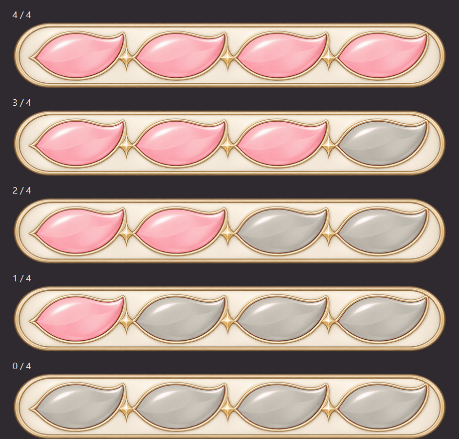

# Daily-action energy gauge artwork

## Confirmed design

The user requested a uniquely pretty but subtle daily-action energy gauge and confirmed:
- Four action segments, displaying 4, 3, 2, 1 or 0 remaining.
- Five separate complete PNGs.
- Soft-pink petal jewels in a slim ivory-and-gold frame.
- Local image processing to finish the set after the built-in image generator reached its usage limit.

## Assets

All five PNGs are **1984 × 320**, RGBA, with identical frame geometry, padding and alpha.
Pink petals indicate available actions; muted ivory-grey petals indicate spent actions.
Available petals occupy the left side, with spent petals on the right.

| Available actions | File |
| --- | --- |
| 4 | `Assets/Graphic/UI/EnergyGauge_4.png` |
| 3 | `Assets/Graphic/UI/EnergyGauge_3.png` |
| 2 | `Assets/Graphic/UI/EnergyGauge_2.png` |
| 1 | `Assets/Graphic/UI/EnergyGauge_1.png` |
| 0 | `Assets/Graphic/UI/EnergyGauge_0.png` |

The preview labels and dark backdrop are for comparison only; they are not present in the sprites.

## Unity use

Each texture is configured as **Sprite (2D and UI)**, **Single**, with a centered pivot,
100 pixels per unit, bilinear filtering, clamp wrapping, no mipmaps and no compression.
Swap the Image's sprite to the appropriate state. Use **Image Type: Simple** and **Preserve Aspect**.
Do not nine-slice or stretch the complete gauge. All states share an aspect ratio of **6.2:1**;
at 268 UI units wide, the sprite is about 43.2 units tall.

The existing MainMenu `Energy UI` RectTransform was inspected at approximately 267.871 × 62.
It has not been edited or assigned these sprites. No prefab, code, action-cost rule, daily reset,
profile field or localization change is included in this artwork task.

## Production and verification

Mode: **built-in image generation**, followed by **user-authorized local image processing**.

The full-state master was generated at 2032 × 774. A second generated empty-state image baked
a checkerboard into its background. A background-removal retry hit the image generator's usage
limit; that draft is not used by the final set.

Every final state instead comes from the transparent full-state master. The same 1984 × 320 crop
at source coordinate (24, 215) removes excess surrounding padding without scaling the artwork.
Only rose-colored pixels inside the spent petals are recolored. Existing gold, ivory, frame,
unspent petals and alpha remain unchanged between states. The recoloring retains the source
luminance detail while moving the fill to a muted warm neutral.

The export verifies zero alpha differences and zero pixel differences outside the selected
spent-petal masks. The mask pixel counts from left to right are 54,279; 55,418; 55,789; 55,066.
The five-state preview was visually inspected for legibility, consistent framing and correct counts.
The local export script and intermediate preview are under ignored `Library/EnergyGaugeWork`.
The generated source remains in the image tool's output directory.

Relevant live MainMenu/general UI Trello cards and the main planning deck were refreshed.
The user's confirmations define this asset's scale and design; old action-point mockup values
are not implemented as gameplay rules.

## Full-state generation prompt

Use case: stylized-concept. Create one transparent horizontal daily-action gauge with exactly four soft-pink petal jewels, a slim ivory-and-champagne-gold frame, restrained satin highlights and no text.

